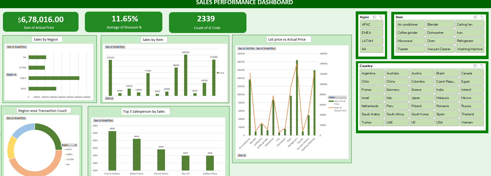

# Sales Performance Dashboard (Excel)

## Overview
This project showcases an interactive Sales Performance Dashboard built in Microsoft Excel to analyze sales, profit, and business performance using dynamic visualizations.

## Features
- Interactive slicers
- Pivot Tables & Pivot Charts
- KPI Cards
- VBA Automation
- Sales & Profit Analysis

## Tools Used
- Microsoft Excel
- Pivot Tables
- Pivot Charts
- Slicers
- VBA

## Dashboard Preview

## Skills Demonstrated
- Data Cleaning
- Data Analysis
- Dashboard Design
- Data Visualization
- Excel Automation

## 👤 Author

**Deepa Kumari Adhikari**

Aspiring Finance and Tax Analyst passionate about using Excel, SQL, and Power BI to solve business problems through data analysis.

Connect with me:
- LinkedIn: [Deepa Kumari Adhikari](www.linkedin.com/in/deepa-kumari-adhikari-inspiria)
